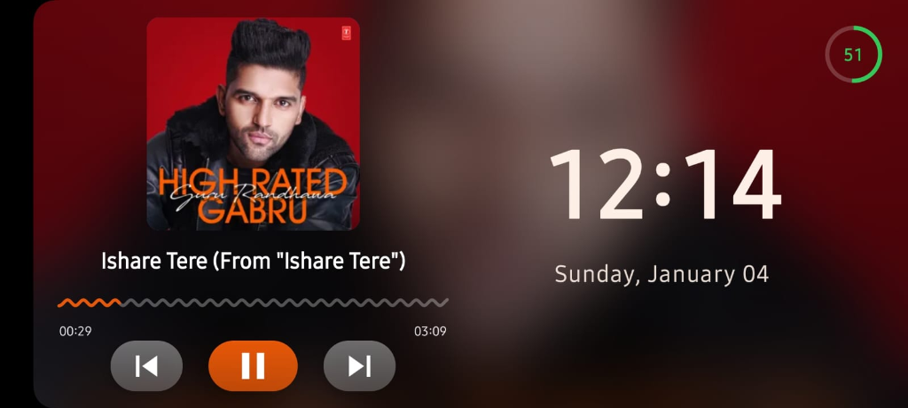
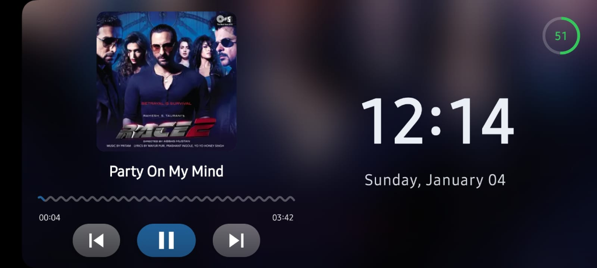

# DockFlow 🎵⏰

A beautiful, feature-rich Android dock mode app built with Jetpack Compose. Transform your Android device into an elegant bedside clock with universal music controls.


## ✨ Features

### 🎵 Universal Music Control
- **Works with any music app** - Spotify, YouTube Music, Apple Music, and more
- **Smart ad detection** - Automatically mutes Spotify ads
- **Animated waveform progress bar** - Smooth, flowing wave animation during playback
- **Tap-to-seek** - Touch anywhere on the waveform to jump to that position
- **Gradient playback buttons** - Beautiful 3D depth with shadow elevation
- **Dynamic theming** - Colors extracted from album art using Palette API

### ⏰ Smart Clock Display
- **12-hour format** with AM/PM indicator
- **Color harmony** - Clock text blends 90% white + 10% album art accent color
- **OLED burn-in protection** - Pixel shifting every 5 minutes
- **Date display** - Full day and date (e.g., "Saturday, January 03")

### 🔋 Battery Indicator
- **Real-time monitoring** - Instant updates via BroadcastReceiver
- **Color-coded states:**
  - 🟢 Green when charging (with pulsing animation)
  - 🔴 Red when ≤20% battery
  - 🟠 Orange when 21-50% battery
  - 🎨 Accent color when >50% battery
- **Circular progress ring** - Visual battery level indicator

### 🎨 Premium Design
- **Glassmorphic background** - Blurred album art with dynamic colors
- **Immersive fullscreen** - Hidden status bar and navigation bar
- **Landscape orientation** - Optimized for dock mode
- **Always-on display** - Screen stays on while active
- **Smooth animations** - 60 FPS animations throughout

## 📱 Screenshots

<p align="center">
  
  &nbsp;&nbsp;&nbsp;
  
</p>

*DockFlow in action - Beautiful glassmorphic design with dynamic theming based on album art*

## 🚀 Getting Started

### Requirements
- Android 8.0 (API 26) or higher
- Android Studio Hedgehog or newer
- Notification Listener permission

### Installation

1. **Clone the repository**
   ```bash
   git clone https://github.com/yourusername/DockFlow.git
   cd DockFlow
   ```

2. **Open in Android Studio**
   - Open Android Studio
   - Select "Open an Existing Project"
   - Navigate to the cloned directory

3. **Build and Run**
   - Sync Gradle files
   - Connect your Android device or start an emulator
   - Click Run ▶️

4. **Grant Permissions**
   - When prompted, grant Notification Listener permission
   - This allows DockFlow to control music playback

## 🎮 Usage

### Music Controls
- **Play/Pause** - Tap the center button
- **Skip tracks** - Use previous/next buttons
- **Seek** - Tap anywhere on the waveform progress bar
- **Auto-mute ads** - Spotify ads are automatically detected and muted

### Battery Monitoring
- Battery percentage and charging status displayed in top-right corner
- Automatically updates when charger is plugged/unplugged

### Customization
- Album art colors automatically theme the entire interface
- Clock color harmonizes with current album art

## 🏗️ Architecture

### Tech Stack
- **Jetpack Compose** - Modern declarative UI framework
- **Material3** - Latest Material Design components
- **Kotlin Coroutines & Flow** - Reactive state management
- **MediaSession API** - Universal music control across all apps
- **Palette API** - Dynamic color extraction from album art
- **DataStore** - Persistent preferences storage
- **BroadcastReceiver** - Real-time battery monitoring

### Project Structure

```
app/src/main/java/com/dockflow/
├── MainActivity.kt                      # App entry point, fullscreen setup
├── data/model/
│   ├── MediaMetadata.kt                 # Media playback data models
│   └── PlaybackState.kt                 # Playback state enum
├── service/
│   └── MediaSessionService.kt           # MediaSession listener & control
├── ui/
│   ├── components/
│   │   ├── BatteryIndicator.kt          # Real-time battery display
│   │   ├── ClockSection.kt              # Clock with burn-in protection
│   │   ├── GlassmorphicBackground.kt    # Blurred album art background
│   │   ├── MusicPlayerSection.kt        # Music player UI
│   │   └── WaveformProgressBar.kt       # Animated wavy progress bar
│   ├── screens/
│   │   ├── DockModeScreen.kt            # Main dock screen
│   │   └── PermissionScreen.kt          # Permission request UI
│   └── theme/
│       ├── Color.kt                     # Color definitions
│       ├── Theme.kt                     # Theme configuration
│       └── Type.kt                      # Typography
└── util/
    ├── AdDetector.kt                    # Spotify ad detection & muting
    └── ColorExtractor.kt                # Palette API color extraction
```

## 🎨 Key Features Explained

### Animated Waveform Progress Bar
- Custom implementation using `Canvas` and `Path`
- Quadratic bezier curves for smooth wave rendering
- Continuous phase shifting animation when playing
- Flattens to a line when paused
- 3dp amplitude, 0.15 frequency for subtle, gentle waves

### Ad Detection & Auto-Mute
- Pattern matching for common ad keywords
- Detects "Spotify" as artist name
- Automatically mutes device volume when ad detected
- Restores original volume when music resumes

### OLED Burn-in Protection
- Random pixel shifting (-2dp to +2dp) every 5 minutes
- Prevents static elements from burning into OLED screens
- Imperceptible to users but effective for screen longevity

### Dynamic Color Theming
- Extracts vibrant and dominant colors from album art
- Applies colors to buttons, progress bar, and UI elements
- Clock text uses 90% white + 10% accent for subtle harmony

## 🔧 Configuration

### Permissions Required
```xml
<uses-permission android:name="android.permission.WAKE_LOCK" />
<uses-permission android:name="android.permission.MODIFY_AUDIO_SETTINGS" />
```

### Notification Listener
The app requires Notification Listener access to:
- Read media session information
- Control playback across all music apps
- Extract track metadata (title, artist, album art)

## 🤝 Contributing

Contributions are welcome! Please feel free to submit a Pull Request.

1. Fork the repository
2. Create your feature branch (`git checkout -b feature/AmazingFeature`)
3. Commit your changes (`git commit -m 'Add some AmazingFeature'`)
4. Push to the branch (`git push origin feature/AmazingFeature`)
5. Open a Pull Request

## 📝 License

This project is open source and available under the MIT License.

## 🙏 Acknowledgments

- Inspired by modern music player designs
- Built with ❤️ using Jetpack Compose
- Special thanks to the Android developer community

## 📧 Contact

For questions or feedback, please open an issue on GitHub.

---

**Made with ❤️ and Jetpack Compose**
